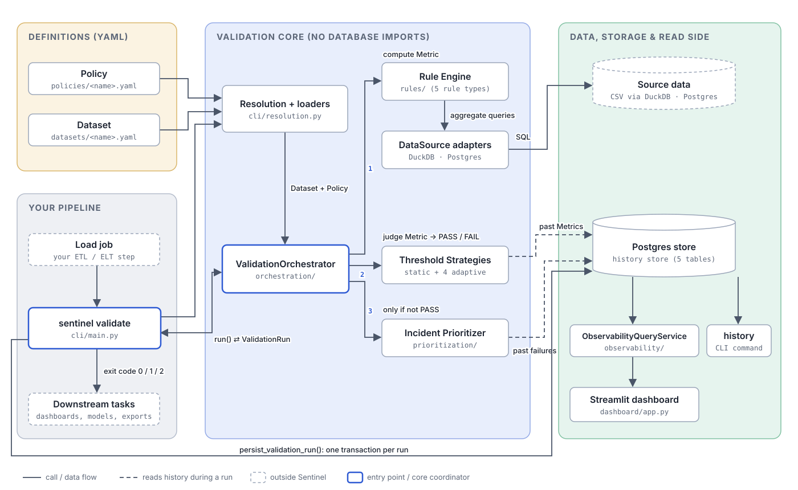
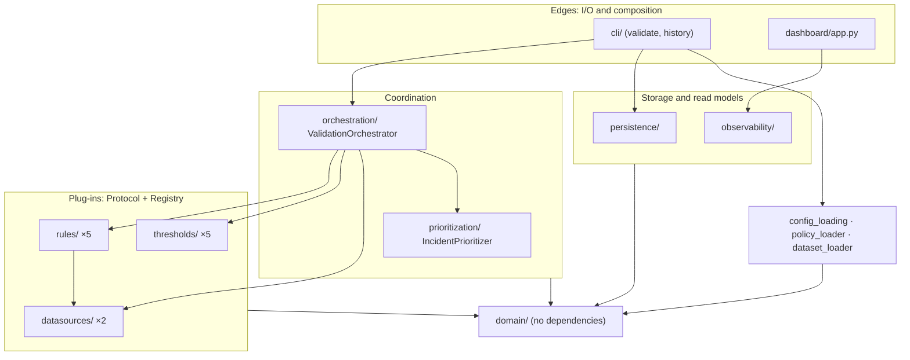
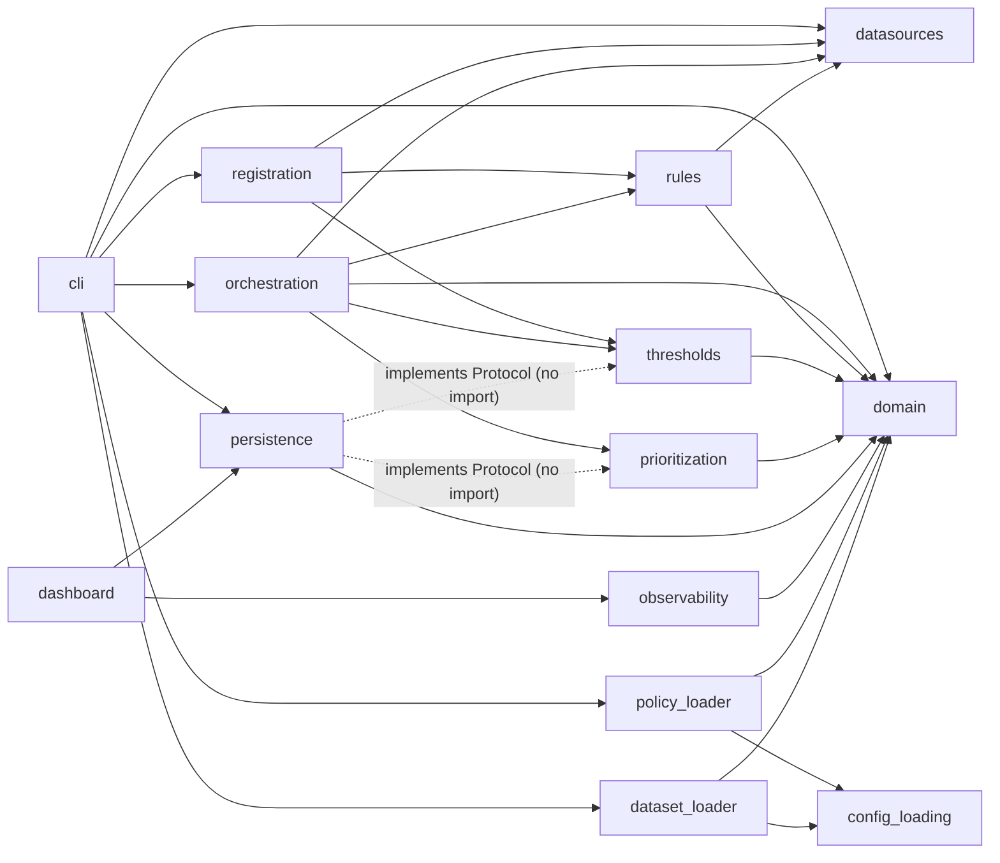
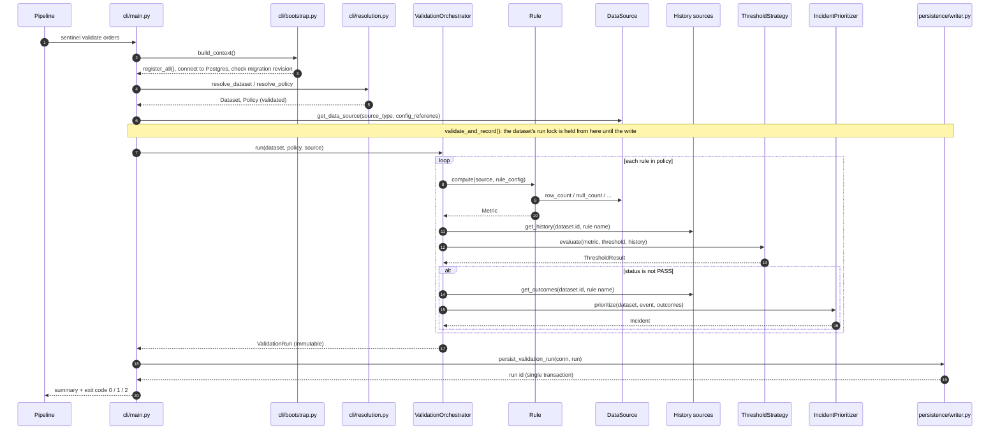

# Architecture Overview

Sentinel is a single Python package (a modular monolith) that runs entirely in-process. There are no services, no message queues, and no background workers. A validation is one CLI invocation that reads a dataset, judges it, records the outcome, and exits with a code your pipeline can act on.

An interactive version of this diagram, with file paths for every box, is in [`docs/assets/architecture.html`](../assets/architecture.html). Open it in a browser.

---

## The problem the architecture is shaped around

Data quality checks usually live inside pipeline code: a `COUNT(*)` with an `assert`, a hard-coded threshold, and no memory of what yesterday looked like. That approach tells you *what* failed but not *whether it matters*, and every pipeline reimplements it slightly differently.

Sentinel separates four concerns that pipelines usually tangle together:

| Concern | Where it lives | Example |
|---|---|---|
| **What to check** | A declarative Policy (YAML) | "customer_id must be at most 1% null" |
| **How to measure it** | A reusable Rule | `null_rate` computes the fraction of nulls |
| **What counts as acceptable** | A Threshold Strategy | `static` (fixed bound) or `median_mad` (learned from history) |
| **What happened before** | Persisted runtime facts | Every Metric, verdict and Incident, queryable later |

Keeping these apart is what lets a threshold evolve from a fixed number to a statistical model without touching the rule, and what lets one rule implementation work against DuckDB and Postgres alike.

---

## Definitions and facts

The most important modelling decision in Sentinel is the split between two kinds of objects:

- **Definitions** are config-time and change only when someone edits YAML: `Policy`, `RuleConfig`, `ThresholdConfig`, `Dataset`.
- **Facts** are runtime and immutable once produced: `Metric`, `ThresholdResult`, `QualityEvent`, `ValidationRun`, `Incident`.

Within facts there is a second, equally important split. A **measurement** (`Metric.value`, for example a null rate of 0.083) is stored separately from the **judgement** of that measurement (`ThresholdResult.status`, for example FAIL). Because the raw number survives independently of any verdict:

- adaptive strategies can compute today's bounds from past *values*, not past verdicts
- a tightened threshold can be replayed against history
- a slowly drifting metric is visible on a trend chart before it ever fails

See [Domain Model](../components/domain-model.md) for the full entity reference.

---

## Layers

| Layer | Packages | Responsibility |
|---|---|---|
| Domain | `domain/` | Plain data. No behaviour, no I/O, no imports from elsewhere in Sentinel. |
| Plug-ins | `rules/`, `thresholds/`, `datasources/` | Small interfaces (`typing.Protocol`) with several implementations, each selected by a string in YAML through a registry. |
| Coordination | `orchestration/`, `prioritization/` | Pure logic that wires plug-ins together. Never imports a database driver for Sentinel's own store. |
| Storage and read models | `persistence/`, `observability/`, `validation_service.py` | Postgres migrations, writes, run locking, history reads, and the read-only query layer behind the dashboard. |
| Edges | `cli/`, `dashboard/` | Turn files, a terminal and a browser into calls on the layers above. `cli/main.py` is the composition root. |

---

## Dependency rules

These rules come from the actual imports in `src/sentinel/` and are what keep the core testable without a database.

1. `domain` and `datasources/base.py` import nothing else from Sentinel.
2. Rules depend on the `DataSource` interface, never on a concrete adapter.
3. `thresholds` and `prioritization` depend only on `domain`. They receive history as plain lists.
4. `orchestration` never imports `persistence`. History arrives through two injected interfaces, `HistoricalMetricsSource` and `FailureHistorySource`.
5. `persistence` never imports `thresholds` or `prioritization`. Its history classes satisfy those packages' Protocols structurally, by having methods of the right shape.
6. `observability` reads persisted facts only. It never re-implements validation, threshold or prioritization logic.
7. Only `cli/`, `registration.py` and `dashboard/` know about concrete implementations across layers.

Rule 4 together with rule 5 is **dependency inversion**: the code that needs history defines the interface it needs, the storage layer provides it, and only the composition root (`cli/main.py`) connects the two.

---

## Execution flow of `sentinel validate`

The orchestrator does no I/O of its own apart from the calls on its injected collaborators. Persistence happens *after* the run is complete, in `validation_service.py`, so a `ValidationRun` is fully assembled in memory before anything is written.

### Quality failure vs. execution error

These are different outcomes and Sentinel reports them differently.

| | Quality failure | Execution error |
|---|---|---|
| Meaning | The data was measured and did not meet the policy | Sentinel could not complete the measurement |
| Examples | null rate 8% against a 1% limit | malformed YAML, unknown rule type, unreachable Postgres, `InsufficientHistoryError` |
| Run persisted? | Yes, with every event and incident | No. The exception propagates before persistence. |
| Exit code | `2` if a blocking rule failed, otherwise `0` | Non-zero with a Python traceback (Python's default, `1`) |

---

## Architectural patterns

| Pattern | Where | Why it fits | What it costs |
|---|---|---|---|
| **Strategy** | Rules, threshold strategies, data sources | One step ("judge this metric") has several interchangeable algorithms, chosen per rule in YAML | More files and indirection than an `if/elif` chain |
| **Registry + decorator** | `rules/registry.py`, `thresholds/registry.py`, `datasources/registry.py` | Turns a YAML string into a class, so adding a type changes no existing code | Global module-level state; registration depends on imports, hence the explicit `register_all()` |
| **Protocol (structural typing)** | `Rule`, `ThresholdStrategy`, `DataSource`, both history sources | No inheritance needed; storage can satisfy a consumer's interface without importing it | Shape mismatches surface in `mypy`, not at import time |
| **Dependency inversion + composition root** | History sources, `cli/main.py::validate` | Core logic is testable with in-memory fakes; storage is swappable | You must know that `cli/main.py` is where implementations are chosen |
| **Null Object** | `NullHistorySource`, `NullFailureHistorySource` | `ValidationOrchestrator()` works with no arguments; no `if source is None` branches | A missing wire-up silently means "no history" rather than an error |
| **Immutable facts** | Frozen dataclasses and frozen pydantic models | A run is a historical record and must not change after the fact | Assembly needs local lists, then a final constructor call |

### Where Sentinel deliberately does *not* abstract

`ValidationOrchestrator`, `IncidentPrioritizer` and `ObservabilityQueryService` are plain concrete classes, not Protocols. A Protocol and registry earn their keep when several implementations are selected at runtime by a config string. Each of these has exactly one algorithm, so an interface would be indirection without payoff. Extracting one later is a small, additive change.

Similarly, there is no repository layer, no ORM, no dependency-injection framework, and no plugin loader. `persistence/writer.py` and `reader.py` each expose the one function their caller needs.

---

## Further reading

- [Design Decisions](design-decisions.md): the significant decisions, the alternatives considered, and when each should be revisited.
- [Component reference](../README.md#components): one page per component.
