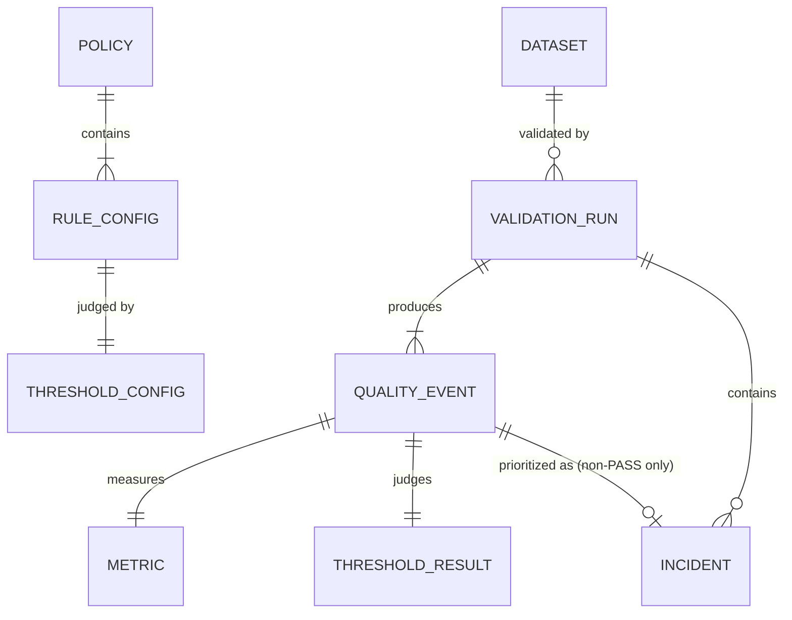

# Domain Model

**Location:** `src/sentinel/domain/`
**Depends on:** nothing else in Sentinel (pydantic only)
**Used by:** every other package

The domain package defines Sentinel's vocabulary. It contains data and enums only: no I/O, no business logic, and no imports from the rest of Sentinel.

| File | Contents |
|---|---|
| `dataset.py` | `Dataset`, `Criticality` |
| `policy.py` | `Policy`, `RuleConfig`, `ThresholdConfig` |
| `metric.py` | `Metric` |
| `events.py` | `Status`, `Severity`, `ThresholdResult`, `QualityEvent`, `ValidationRun` |
| `incident.py` | `IncidentPriority`, `IncidentScoreComponents`, `Incident` |

---

## Definitions (config-time)

Definitions are **frozen pydantic models**. They come from human-edited YAML, so they are validated on load, and they are immutable once loaded.

### `Dataset`

| Field | Type | Notes |
|---|---|---|
| `id` | `str` | Stable identifier. Used as the key for all history lookups. |
| `name` | `str` | Display name. `sentinel history` looks datasets up by name. |
| `source_type` | `str` | Registry key of the `DataSource` to use: `duckdb` or `postgres`. |
| `environment` | `str` | Free text, for example `local` or `prod`. |
| `owner` | `str` | Owning team. |
| `criticality` | `Criticality` | `low`, `medium`, `high` or `critical`. Feeds incident prioritization. |
| `config_reference` | `str \| None` | Adapter-specific pointer: a CSV path for `duckdb`, a connection URL for `postgres`. |

### `Policy`

| Field | Type | Notes |
|---|---|---|
| `dataset` | `str` | Dataset this policy applies to. |
| `version` | `str` | Defaults to `"unversioned"`. Copied onto every `ValidationRun`. |
| `rules` | `tuple[RuleConfig, ...]` | At least one rule is required. |

### `RuleConfig`

| Field | Type | Default | Notes |
|---|---|---|---|
| `name` | `str` | | Unique within the policy. Becomes the `Metric.metric_name` and the history key. |
| `type` | `str` | | Registry key of the `Rule`, for example `null_rate`. Stored as `rule_type`. |
| `column` | `str \| None` | `None` | Required by `null_rate`, `uniqueness` and `freshness`. |
| `expected_schema` | `dict[str, str] \| None` | `None` | Required by `schema`. |
| `severity` | `Severity` | `warning` | `info`, `warning`, `high` or `critical`. |
| `blocking` | `bool` | `true` | Whether a FAIL on this rule fails the pipeline (exit code 2). |
| `threshold` | `ThresholdConfig` | | |

### `ThresholdConfig`

| Field | Type | Notes |
|---|---|---|
| `strategy` | `str` | Registry key of the `ThresholdStrategy`. |
| `params` | `dict[str, Any]` | Strategy-specific parameters. |

Any YAML key other than `strategy` is collected into `params`, so `{strategy: static, min: 1000}` becomes `params={"min": 1000}`. The domain cannot know every strategy's parameters, so each strategy validates its own and raises `ThresholdConfigError` for a missing or invalid one. A typo in a parameter name is therefore detected when the strategy runs, not when the policy loads.

---

## Facts (runtime)

Facts are **frozen dataclasses**. Sentinel creates them, so they need immutability rather than validation. None of them carries a database id; ids are assigned by `persistence/mapping.py` when a run is written.

### `Metric`

What a rule measured, before any judgement.

| Field | Type | Notes |
|---|---|---|
| `metric_name` | `str` | Equal to the rule's `name`. |
| `value` | `float` | The number a strategy evaluates. |
| `computed_at` | `datetime` | UTC. |
| `details` | `str \| None` | Optional JSON from the rule, for example the schema rule's column-level diff. Never affects pass/fail. |

### `ThresholdResult`

A strategy's verdict about one Metric.

| Field | Type | Notes |
|---|---|---|
| `status` | `Status` | `pass`, `warn` or `fail`. Built-in strategies return `pass` or `fail`. |
| `expected` | `str` | Human-readable, for example `row_count >= 1000`. |
| `strategy_type` | `str` | Which strategy produced it. |
| `details` | `str \| None` | JSON with the computed baseline, bounds, deviation and sample size. |

### `QualityEvent`

One rule's complete outcome within a run. It composes a `Metric` and a `ThresholdResult` and copies two policy decisions from the `RuleConfig`.

| Field / property | Notes |
|---|---|
| `severity`, `blocking` | Copied from `RuleConfig`, so an event is self-describing without the policy. |
| `metric`, `threshold_result` | The measurement and the judgement. |
| `rule_name`, `actual`, `expected`, `status` | Read-only properties over the two parts. |
| `details`, `threshold_details` | Pass-throughs to `Metric.details` and `ThresholdResult.details`. |

### `ValidationRun`

One execution of one Policy against one Dataset.

| Field | Notes |
|---|---|
| `dataset` | The full `Dataset`, so the run is self-contained. |
| `policy_version` | Snapshot of `Policy.version`. |
| `started_at`, `finished_at` | UTC. |
| `status` | Worst status across all events (FAIL > WARN > PASS). **Ignores `blocking`.** |
| `quality_events` | One per rule, in policy order. |
| `incidents` | One per non-PASS event, in the same relative order. |

`status` is a required field rather than a computed property because aggregation is behaviour, and this package holds none. The orchestrator computes it.

### `Incident`

How much a non-passing event matters.

| Field | Notes |
|---|---|
| `quality_event` | The event this incident is about. |
| `priority` | `info`, `warning`, `high` or `critical`. |
| `score` | 0–100, rounded to one decimal. |
| `components` | `IncidentScoreComponents`: the five 0–100 sub-scores. |
| `reasons` | Five human-readable strings, criticality first. |

---

## Status, Severity, Criticality, Priority

These four enums are easy to confuse. They answer different questions and are set by different parties.

| Enum | Question | Set by | When |
|---|---|---|---|
| `Status` | Did the value meet the threshold? | Threshold strategy | Each run |
| `Severity` | How serious is a failure of *this rule*? | Policy author | Config time |
| `Criticality` | How important is *this dataset*? | Dataset owner | Config time |
| `IncidentPriority` | How urgently should a person look at this failure? | Incident prioritizer | Each run, non-PASS only |

---

## Entity relationships



Policy, RuleConfig and ThresholdConfig are not persisted. A run records the policy's version string, and each event records its strategy type, severity and blocking flag, which is enough to explain a historical verdict.

---

## Worked example

`sentinel validate orders` against `data/orders.csv`, on an empty history store, produces these objects for the `customer_id_not_null` rule (floats abbreviated):

```text
RuleConfig(name="customer_id_not_null", rule_type="null_rate", column="customer_id",
           severity=WARNING, blocking=True,
           threshold=ThresholdConfig(strategy="static", params={"max": 0.01}))

Metric(metric_name="customer_id_not_null", value=0.0833, computed_at=...)   # 1 null in 12 rows

ThresholdResult(status=FAIL, expected="customer_id_not_null <= 0.01",
                strategy_type="static",
                details='{"method": "static", "actual": 0.0833, "min": null, "max": 0.01}')

QualityEvent(severity=WARNING, blocking=True, metric=..., threshold_result=...)

Incident(priority=HIGH, score=60.0,
         components=IncidentScoreComponents(severity_score=40, criticality_score=70,
                                            deviation_score=100, frequency_score=10,
                                            confidence_score=60),
         reasons=("Dataset criticality: HIGH", "Validation severity: WARNING", ...))
```

All five rules' events and incidents are collected into one `ValidationRun(status=FAIL, ...)`, which `persistence/writer.py` then writes in a single transaction.

---

## Tests

`tests/unit/domain/`: construction, validation of bad input, immutability, and the `QualityEvent` pass-through properties.
