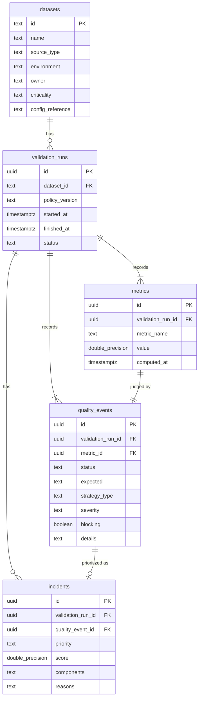

# Persistence

**Location:** `src/sentinel/persistence/`
**Depends on:** `domain`, `psycopg` / `psycopg-pool`, `alembic` (migrations only)
**Used by:** `validation_service` (writes), `cli` (`history`, `db`), `orchestration` (through injected history sources), `observability`, `dashboard`

Every completed validation run is written to Sentinel's own store, a **PostgreSQL** database shared by every team, pipeline and process. That history feeds adaptive thresholds, failure-frequency scoring, `sentinel history` and the dashboard.

| File | Role |
|---|---|
| `engine.py` | `connect()` and `create_pool()` for `SENTINEL_DATABASE_URL`. Autocommit, UTC sessions. |
| `migrate.py` | `upgrade()`, `downgrade()`, `current_revision()`, `head_revision()` over Alembic |
| `migrations/` | Alembic environment and versioned migrations, written as raw SQL |
| `locks.py` | `dataset_run_lock(conn, dataset_id)`: per-dataset advisory lock |
| `mapping.py` | `to_rows(run) -> PersistableRun` flattens a `ValidationRun` into rows and assigns UUIDs |
| `writer.py` | `persist_validation_run(conn, run) -> UUID` writes one run in one transaction |
| `history.py` | `PostgresHistoricalMetricsSource`: past metric values for adaptive thresholds |
| `failure_history.py` | `PostgresFailureHistorySource`: past statuses for incident prioritization |
| `reader.py` | `list_recent_runs(conn, dataset_name, limit)` for `sentinel history` |

The entry point that ties these together is `sentinel.validation_service.validate_and_record()`: take the dataset's run lock, run the orchestrator (which reads history), write the run, release the lock.

---

## Schema



- `metrics` and `quality_events` are separate tables. This mirrors the domain's split between measurement and judgement, and lets history queries read raw values without touching verdicts.
- `quality_events.details` holds the **threshold strategy's** JSON (baseline, bounds, deviation). `incidents.components` and `incidents.reasons` are JSON as well.
- Enum-like columns (`status`, `severity`, `priority`, `criticality`) are `TEXT` with `CHECK` constraints: invalid values are rejected, and adding a value is a one-line migration (no enum type to alter).
- `quality_events.metric_id` and `incidents.quality_event_id` are `UNIQUE`, enforcing the one-to-one links. Child tables cascade on delete, so a future retention job only deletes `validation_runs`.

### Indexes

| Index | Serves |
|---|---|
| `validation_runs (dataset_id, started_at DESC)` | Latest runs per dataset: health, history, quality history |
| `metrics (metric_name, computed_at DESC)` | Metric history for adaptive thresholds and trends |
| `metrics (validation_run_id)`, `quality_events (validation_run_id)`, `incidents (validation_run_id)` | Joins from a run to its rows |
| `datasets (name)` | `sentinel history <name>` |
- `datasets` is updated in place on every run, so it always reflects the latest dataset YAML. Every other table is append-only.

### Mutability

| Table | Behaviour |
|---|---|
| `datasets` | Insert, or update on conflict (latest wins) |
| `validation_runs`, `metrics`, `quality_events`, `incidents` | Insert only. Never updated or deleted by Sentinel. |

---

## Write path

```text
persist_validation_run(conn, run)
  rows = to_rows(run)                        # pure; assigns uuid4 ids
  BEGIN
    upsert datasets         (INSERT ... ON CONFLICT DO UPDATE)
    insert validation_runs
    insert metrics          (batched, one per event)
    insert quality_events   (batched, one per event, linked to its metric)
    insert incidents        (batched, one per non-PASS event, linked to its event)
  COMMIT            # or ROLLBACK and re-raise on any error
  return run id
```

Ids are generated in Python, not by the database, so the CLI can print the run id immediately. Incidents are linked to their event row by object identity inside `to_rows()`. One transaction per run means a reader never sees a run with events missing.

## Read paths

| Function | Query | Used by |
|---|---|---|
| `PostgresHistoricalMetricsSource.get_history(dataset_id, metric_name)` | `metrics ⨝ validation_runs`, newest first, `LIMIT 90` | Adaptive thresholds |
| `PostgresFailureHistorySource.get_outcomes(dataset_id, metric_name)` | `quality_events ⨝ metrics ⨝ validation_runs`, newest first, `LIMIT 90` | Prioritizer |
| `list_recent_runs(conn, dataset_name, limit=10)` | Recent runs by dataset **name** with their failed rule names, in one query (`array_agg`) | `sentinel history` |

History reads happen *before* the current run is written, so they always see previous runs only.

---

## Concurrency

Many teams, pipelines and (later) API workers write to the same store at once. Two guarantees make that safe:

1. **Each run is atomic.** One transaction per run, so a reader never sees a run with events missing, and a failed write leaves nothing behind.
2. **Runs of the same dataset are serialized.** A run reads the dataset's history, then writes. Two simultaneous runs of one dataset would otherwise both read the same history and each miss the other: an adaptive baseline would skip a data point, and a repeated failure would be scored as a first occurrence. `dataset_run_lock()` takes a Postgres advisory lock keyed on the dataset id for the whole read-then-write, so the second run waits and then sees the first one's results.

Runs of **different** datasets never wait for each other. The lock is session-level, so it doesn't hold a transaction open while rules query the data source, and Postgres releases it automatically if a process dies. `wait=False` raises `DatasetRunInProgressError` instead of waiting, for callers that should reject a duplicate run (such as an HTTP API returning `409`).

Connections are autocommit: plain reads never leave an idle transaction open. Use `create_pool()` wherever several requests share a process (the dashboard does; the API will).

Read paths return plain values or small projections (`RunSummary`), never reconstructed `ValidationRun` objects. Nothing needs the full object graph back.

The read side used by the dashboard is documented separately in [Observability](observability.md).

---

## Schema evolution

Schema changes are **Alembic migrations written in raw SQL** (no ORM models), in `src/sentinel/persistence/migrations/versions/`. They ship inside the package.

```bash
sentinel db upgrade     # apply pending migrations (run once per deploy)
sentinel db current     # show the store's revision and the latest available
alembic revision -m "add owner index"   # new migration file (uses alembic.ini)
```

- The CLI **never** changes the schema. On start it compares the store's revision with the code's head revision and exits with code `3` if they differ, so a deploy can't silently run against an old schema.
- `upgrade` takes an advisory lock, so several deploys starting at once apply each migration exactly once.
- Every migration has a `downgrade()`.

## Operational notes

- **Local setup:** `docker compose up -d`, then `sentinel db upgrade`. The default URL matches the compose service.
- **Separate stores per environment.** Point `SENTINEL_DATABASE_URL` at different databases (the demo uses `sentinel_demo`).
- **Teams share one store.** Each dataset's `owner` records the team; there is no access isolation between teams yet.
- **Credentials** come from the URL; in production supply it through your secret manager, not a file in the repo.
- **Not persisted:** policies themselves (only `policy_version`), and the rule-side `Metric.details` (for example the schema rule's column diff).

## Tests

Store tests run against a real Postgres. `tests/conftest.py` recreates a `sentinel_test` database once per session (on the server in `SENTINEL_TEST_POSTGRES_DSN`), migrates it, and empties every table before each test. Without Postgres they are skipped locally; CI sets `SENTINEL_REQUIRE_POSTGRES=1` so they fail instead.

- `tests/unit/persistence/`: engine, migrations (upgrade, idempotency, downgrade round trip, constraints), run lock, mapping, writes and history reads.
- `tests/integration/test_concurrent_runs.py`: ten simultaneous runs across two datasets; checks every run is stored and each dataset's runs saw 0, 1, 2, 3, 4 prior observations (serialized, no lost updates).
