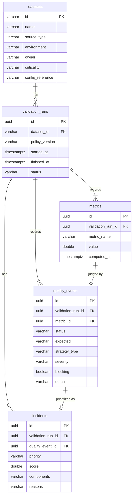

# Persistence

**Location:** `src/sentinel/persistence/`
**Depends on:** `domain`, `duckdb`
**Used by:** `cli` (writes and `history`), `orchestration` (through injected history sources), `dashboard` (connection only)

Every completed validation run is written to Sentinel's own history store, a DuckDB file. That history feeds adaptive thresholds, failure-frequency scoring, `sentinel history` and the dashboard.

| File | Role |
|---|---|
| `engine.py` | `get_connection(path=None)` opens `SENTINEL_DB_PATH` (default `./sentinel.duckdb`) |
| `schema.py` | `ensure_schema(conn)` creates tables and applies additive column changes. Idempotent. |
| `mapping.py` | `to_rows(run) -> PersistableRun` flattens a `ValidationRun` into rows and assigns UUIDs |
| `writer.py` | `persist_validation_run(conn, run) -> UUID` writes one run in one transaction |
| `history.py` | `DuckDBHistoricalMetricsSource`: past metric values for adaptive thresholds |
| `failure_history.py` | `DuckDBFailureHistorySource`: past statuses for incident prioritization |
| `reader.py` | `list_recent_runs(conn, dataset_name, limit)` for `sentinel history` |

---

## Schema



- `metrics` and `quality_events` are separate tables. This mirrors the domain's split between measurement and judgement, and lets history queries read raw values without touching verdicts.
- `quality_events.details` holds the **threshold strategy's** JSON (baseline, bounds, deviation). `incidents.components` and `incidents.reasons` are JSON as well.
- Enum-like columns (`status`, `severity`, `priority`, `criticality`) are plain strings, so adding a value never requires a type migration.
- `datasets` is updated in place on every run, so it always reflects the latest dataset YAML. Every other table is append-only.

### Mutability

| Table | Behaviour |
|---|---|
| `datasets` | Insert, or update on conflict (latest wins) |
| `validation_runs`, `metrics`, `quality_events`, `incidents` | Insert only. Never updated or deleted by Sentinel. |

---

## Write path

```text
persist_validation_run(conn, run)
  rows = to_rows(run)                        # pure; assigns uuid4 ids
  BEGIN
    upsert datasets
    insert validation_runs
    insert metrics          (one per event)
    insert quality_events   (one per event, linked to its metric)
    insert incidents        (one per non-PASS event, linked to its event)
  COMMIT            # or ROLLBACK and re-raise on any error
  return run id
```

Ids are generated in Python, not by the database, so the CLI can print the run id immediately. Incidents are linked to their event row by object identity inside `to_rows()`. One transaction per run means a reader never sees a run with events missing.

## Read paths

| Function | Query | Used by |
|---|---|---|
| `DuckDBHistoricalMetricsSource.get_history(dataset_id, metric_name)` | `metrics ⨝ validation_runs`, newest first, `LIMIT 90` | Adaptive thresholds |
| `DuckDBFailureHistorySource.get_outcomes(dataset_id, metric_name)` | `quality_events ⨝ metrics ⨝ validation_runs`, newest first, `LIMIT 90` | Prioritizer |
| `list_recent_runs(conn, dataset_name, limit=10)` | Recent runs by dataset **name**, plus each run's failed rule names | `sentinel history` |

History reads happen *before* the current run is written, so they always see previous runs only.

Read paths return plain values or small projections (`RunSummary`), never reconstructed `ValidationRun` objects. Nothing needs the full object graph back.

The read side used by the dashboard is documented separately in [Observability](observability.md).

---

## Schema evolution

`ensure_schema()` runs on every CLI start. It executes `CREATE TABLE IF NOT EXISTS` for each table, then each statement in `_COLUMN_ADDITIONS` (currently `ALTER TABLE quality_events ADD COLUMN IF NOT EXISTS details VARCHAR`). Existing database files are upgraded in place. Columns added this way are `NULL` for rows written before they existed.

Destructive or data-transforming changes are not supported by this mechanism. Introduce a migration tool when one is needed.

## Operational notes

- **One writer per file.** DuckDB lets only one process hold a database file for writing. Do not run two `sentinel validate` processes against the same store concurrently, and stop the dashboard before running `validate` against the store it has open.
- **Separate stores per environment.** Point `SENTINEL_DB_PATH` at different files to keep, for example, a demo store apart from your real one.
- **Not persisted:** policies themselves (only `policy_version`), and the rule-side `Metric.details` (for example the schema rule's column diff).

## Tests

- `tests/unit/persistence/`: engine, schema idempotency, mapping, transactional writes and metric history reads, each against a temporary DuckDB file.
- `DuckDBFailureHistorySource` has no dedicated unit test. It is exercised by the `sentinel validate` path in `tests/integration/test_cli.py`.
