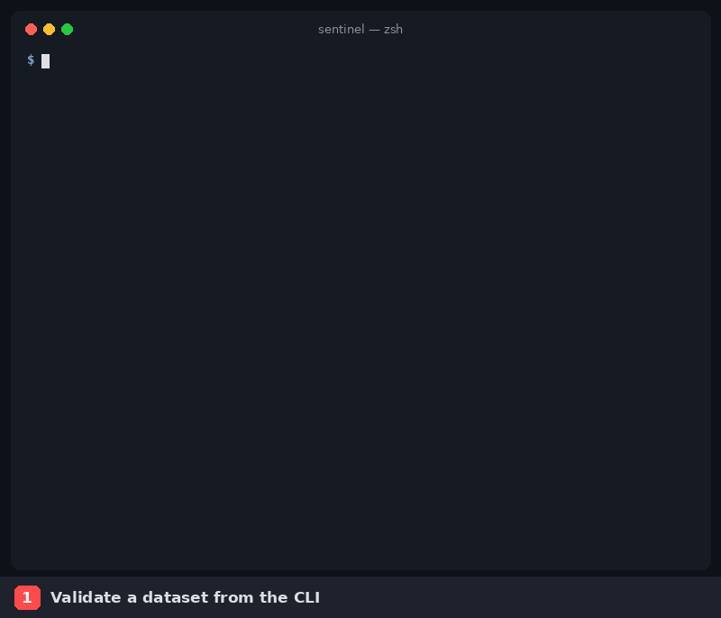

# Sentinel by example

Sentinel checks that a dataset looks the way you expect before anyone uses it: enough rows, no missing keys, no duplicates, fresh timestamps, the right columns. When a check fails, it records an incident, says how much it matters, and keeps the history so you can see patterns over time.

This guide teaches Sentinel through ready-made scenarios. Each one is a small, realistic situation with data that has known problems planted in it, so you can predict what Sentinel will say and then check that it does.



*Scenario 1 (`customers`), scenario 6 (`shipments`), then the dashboard from scenario 10, with the simulated dataset from scenario 9.*

---

## Five ideas you need first

| Idea | What it is | Where it lives |
|---|---|---|
| **Dataset** | *What* to check: where the data is, who owns it, and how important it is (`criticality`). | `datasets/<name>.yaml` |
| **Policy** | *How* to check it: a list of rules. | `policies/<name>.yaml` |
| **Rule** | One measurement: `row_count`, `null_rate`, `uniqueness`, `freshness` or `schema`. | An entry under `rules:` |
| **Threshold strategy** | How a rule decides pass or fail. `static` uses fixed limits; the four adaptive strategies learn the limits from past runs. | `threshold:` on each rule |
| **Run and incident** | Every `sentinel validate` is a *run*, stored with all its results. Each failed rule becomes an *incident* with a priority (INFO, WARNING, HIGH, CRITICAL). | Sentinel's Postgres store |

A dataset and its policy share a name: `sentinel validate orders` reads `datasets/orders.yaml` and `policies/orders.yaml`.

## How to read the output

```text
Dataset: products
Run ID:  a64b34bc-0a9a-4858-9533-2b848eb054b0
Result:  PASS

  ✓ row_count  actual=30  expected: row_count >= 10
  ✗ description_not_null  actual=0.2  expected: description_not_null <= 0.05
      priority=WARNING score=33.0  Dataset criticality: LOW
```

- **✓ / ✗** is each rule's own verdict. `actual` is what Sentinel measured; `expected` is what the threshold allowed.
- **The indented line** under a ✗ is its incident: priority, a 0–100 score, and the first of the reasons behind it.
- **`Result`** and the **exit code** only count *blocking* rules. A non-blocking rule can fail (✗) while the run still passes.

| Exit code | Meaning | Typical use |
|---|---|---|
| `0` | No blocking rule failed | Let the pipeline continue |
| `1` | A rule returned WARN (no built-in strategy does this yet) | |
| `2` | At least one blocking rule failed | Stop the pipeline |
| `3` | Sentinel's store isn't set up (`sentinel db upgrade` not run) | Fix the deployment |

Metric units: `null_rate` is a fraction (0.2 = 20%), `uniqueness` counts duplicate values, `freshness` is minutes since the newest timestamp, and `schema` counts column differences.

---

## Set up (once)

You need [uv](https://docs.astral.sh/uv/) and Docker.

```bash
uv sync --all-groups --all-extras    # Sentinel, dev tools, dashboard, all database drivers
docker compose up -d                  # Postgres (Sentinel's store), MySQL and MongoDB
uv run sentinel db upgrade            # create the store's tables
export MYSQL_PASSWORD=sentinel        # used by the shipments example
uv run python -m examples.setup       # load the database examples and backfill history
```

Only want the CSV scenarios (1–4)? `docker compose up -d postgres` is enough, because Sentinel always needs Postgres for its store. `examples.setup` skips MySQL and MongoDB with a hint if they aren't running.

Run every command from the repository root. Your Run IDs, timestamps and freshness minutes will differ from the outputs shown here; everything else should match.

---

## The scenarios

Work through them in order. Each builds on the one before.

| # | Scenario | The situation | You'll learn |
|---|---|---|---|
| 1 | [A healthy dataset](01-customers-healthy-dataset.md) | A clean customer list | The basic rules, the schema check, a passing run |
| 2 | [Track a problem without blocking](02-products-non-blocking-rules.md) | Product descriptions are often missing, but that shouldn't stop the pipeline | Blocking vs non-blocking rules, severity, how priority is scored |
| 3 | [A broken load](03-orders-broken-load.md) | A bad daily orders file | Every rule type failing, exit code 2, recurring failures, history |
| 4 | [Thresholds that learn](04-signups-adaptive-thresholds.md) | Signups follow a weekly rhythm | The four adaptive strategies, side by side |
| 5 | [Checking a Postgres table](05-events-postgres.md) | Product events in a warehouse table | Database sources, freshness, type mapping |
| 6 | [MySQL and secrets](06-shipments-mysql-secrets.md) | Orders shipped twice | Passwords from the environment, a CRITICAL incident |
| 7 | [Documents in MongoDB](07-reviews-mongodb.md) | Reviews with optional fields | Missing fields as nulls, nested fields |
| 8 | [Parquet files and data lakes](08-clickstream-parquet.md) | A clickstream export | Parquet, globs and S3 |
| 9 | [Replay eight weeks](09-simulator-adaptive-thresholds.md) | Which strategy would have caught last month's incidents? | The simulator and its scorecard |
| 10 | [History and the dashboard](10-history-and-dashboard.md) | What happened over the last week? | `sentinel history`, every dashboard view |
| 11 | [Many pipelines at once](11-concurrent-runs.md) | Several teams validating at the same time | Concurrency guarantees |
| 12 | [Validate your own data](12-your-own-dataset.md) | Your table, your rules | Writing a dataset and policy from scratch |

There is also a scripted [guided demo](../../demo/run_demo.sh) (`bash demo/run_demo.sh`): four daily loads of a critical payments dataset going bad and partially recovering, in its own store.

---

## Feature map

| Feature | Scenario |
|---|---|
| Rules: `row_count`, `null_rate`, `uniqueness`, `freshness`, `schema` | 1, 3 (all failing), 5 |
| Strategy: `static` | All |
| Strategies: `percentage_deviation`, `statistical`, `median_mad`, `seasonal` | 4, 9 |
| Sources: CSV (DuckDB), Postgres, MySQL, MongoDB, Parquet | 1–4, 5, 6, 7, 8 |
| Sources: JSON, S3, Snowflake, BigQuery | 8, 12, [Data Sources](../components/data-sources.md#configuration-per-source) |
| Secrets as `${ENV_VAR}` | 6 |
| Blocking vs non-blocking rules | 2, 4 |
| Exit codes `0`, `2`, `3` | 1, 3, 10 |
| Severity, criticality, priority and score | 2, 3, 6 |
| Recurring and persistent failures | 3, 10 |
| Policy versions | 1 |
| History and dashboard | 3, 10 |
| Concurrent runs | 11 |

Each scenario's outcome is pinned by `tests/integration/test_examples.py` and `test_simulator.py`, so these pages stay true as the code changes.
